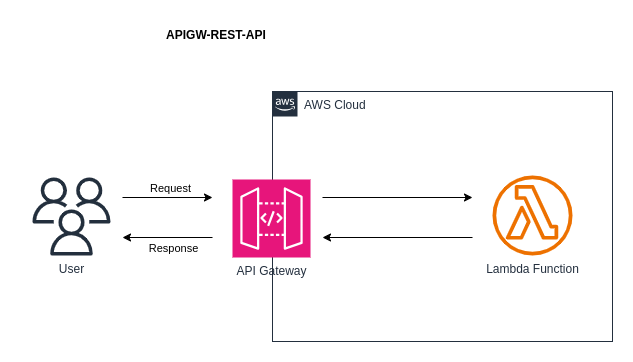

# apigw-rest-api


Create a REST API Gateway integrated with a backend lambda functions.

Synchronous calls are made via a proxy integration. Async calls are made via a non-proxy integration.

## What components and services are involved?



## Run example #01 - 
``` 
1.  Deploy a load balanced Fargate service
        cd /path/to/aws-cdk-examples/application-load-balanced-lambda/deploy
        npm run apigw-rest-api-01-app synth
        npm run apigw-rest-api-01-app list
        npm run apigw-rest-api-01-app deploy
        npm run apigw-rest-api-01-app destroy
        
2.  Test the API:
        /books
            curl -X GET --header "Content-type: application/json" --header "Accept: application/json" https://<custom-path>.execute-api.eu-west-1.amazonaws.com/prod/books
        /books/{id}
            curl -X GET --header "Content-type: application/json" --header "Accept: application/json" https://<custom-path>.execute-api.eu-west-1.amazonaws.com/prod/books/101
            curl -X POST --header "Content-type: application/json" --header "Accept: application/json" --data '{}' https://<custom-path>.execute-api.eu-west-1.amazonaws.com/prod/books/12
```


## Knowledge & Takeaways
* RestApis are synchronous by default and integrations use a proxy by default to enable this. 
* Async calls can be configured via a non-proxy integration. Applications might require async for batch operations or a long-latency operation.
* Adding a "resource" to the root api via CDK just means that you are adding a path to the URL e.g /books (technically... its not essential... accessing resources via the root is possible e.g /prod)

## References
* https://docs.aws.amazon.com/apigateway/latest/developerguide/apigateway-rest-api.html
* https://docs.aws.amazon.com/apigateway/latest/developerguide/set-up-lambda-proxy-integrations.html
* https://repost.aws/knowledge-center/api-gateway-invoke-lambda
* https://docs.aws.amazon.com/sdk-for-javascript/v2/developer-guide/calling-services-asynchronously.html