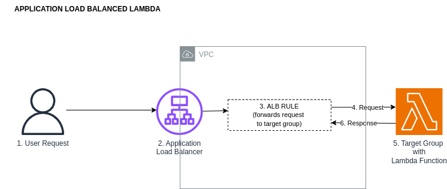

# application-load-balanced-lambda


Deploy a lambda function behind an application load balancer.

## What components and services are involved?



## Run example #01 - a load balanced lambda
``` 
1.  Deploy a load balanced Fargate service
        cd /path/to/aws-cdk-examples/application-load-balanced-lambda/deploy
        npm run application-load-balanced-lambda-app synth
        npm run application-load-balanced-lambda-app list
        npm run application-load-balanced-lambda-app deploy
        npm run application-load-balanced-lambda-app destroy
        
2.  Test the lambda by hitting the load balancer endpoint
        EC2 Dashboard > Load Balancers > Select Load Balancer > DNS Name
    Paste the DNS Name into your broswer and verify the 200 response. 
         http://my-load-balancer-dns-name.com/?page=2&limit-10   
```


## Knowledge & Takeaways
* lambda code can be quickly compiled using [esbuild](https://esbuild.github.io/)
* ALBs support content-based routing rules, meaning you can also route requests to different Lambda functions based on the request content.

## References
* https://aws.amazon.com/blogs/networking-and-content-delivery/lambda-functions-as-targets-for-application-load-balancers/
* https://docs.aws.amazon.com/lambda/latest/dg/services-alb.html