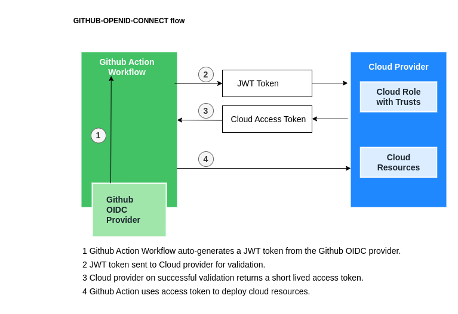

# github-openid-connect


Create an OpenID Connect integration between Github Action workflows and AWS.

## What is OpenID Connect?

Github Actions now support OpenID Connect (OIDC) which provide the ability to get a short-lived token each time a CI/CD pipeline runs. This enables secure deployment of applications to the cloud.

The benefits are:

1. No need to store long-lived secrets in Github at repository or organisation level. This removes the previous administrative effort developers had manually rotating credentials.
2. Integration between Github and the various Cloud providers (AWS, Azure, etc) allows us to leverage a consistent, proven solution to a security problem that does not require custom code.

How it works:

1.  Developer registers an OIDC Identity Provider (Github Actions Token Endpoint) in their Cloud account.
2.  Developer creates a security role in their Cloud account. To the security role a set of "trusts" is registered. Each trust added represents a github repository (with or without branch/tag identifiers).
3.  On running a Github Action workflow pipeline it auto-generates a JWT token which contains a "sub" field. The sub field value identifies a github repository (with or without branch/tag identifiers).
4.  The Github Action workflow sends the JWT token to the Cloud provider (AWS, Azure, etc) and asks for a Cloud security token.
5.  The Cloud access token is returned to Github Actions if it passes validation in the Cloud provider. Validation involves checking that the JWT token sub field value is in the list of "trusts" that is attached to the security role that we setup earlier.
6.  The Github Action workflow uses the returned Cloud access token to execute actions in the Cloud provider account e.g deploy software on AWS.


## What components and services are involved?




## Run example #01 - a lambda function URL http endpoint
``` 
1.  Deploy steps:
        cd /path/to/aws-cdk-examples/github-openid-connect
        npm install
        npm run github-openid-connect-app synth
        npm run github-openid-connect-app list
        npm run github-openid-connect-app deploy
        npm run github-openid-connect-app destroy
        
2.  Example Github action workflow:
      /docs/build-jekyll-and-upload-assets-to-s3.yml 
    
3.  At a minimum the Github action workflow should be able to reach the "Check JWT token validation was successful" step. Modify the workflow to fit your purposes.
```

## Knowledge & Takeaways
* organisations may be more interested in a multi-account setup. An approach [detailed here](https://dev.to/aws-builders/deploying-aws-cdk-apps-using-short-lived-credentials-and-github-actions-59g6).
* authentication in all cases happens by registering an OIDC IdentifyProvider with your cloud provider [OpenIdConnectProvider](https://docs.aws.amazon.com/cdk/api/v2/docs/aws-cdk-lib.aws_iam.OpenIdConnectProvider.html)
  and assuming the federated identity (via an IAM role) to access and interact with the cloud provider resources.
* a federated identity means linking a persons electronic identity and attributes, stored across multiple distinct identity management systems (in this case the actors are Github & AWS).
* the Github workflow job needs two permissions `id-token: write` (to get JWT token from OIDC) and `contents: read` (to checkout the code from the repo) to successfully run with this OIDC integration. 


## References
* https://docs.github.com/en/actions/deployment/security-hardening-your-deployments
* https://aws.amazon.com/blogs/security/use-iam-roles-to-connect-github-actions-to-actions-in-aws/
* https://docs.aws.amazon.com/IAM/latest/UserGuide/id_roles_create_for-idp_oidc.html
* https://awsteele.com/blog/2021/09/15/aws-federation-comes-to-github-actions.html
