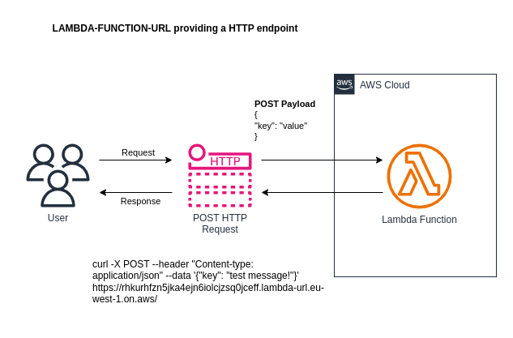

# lambda-function-url


Create a HTTPS endpoint that enables a lambda to be invoked by using Lambda Function URLs.

## What components and services are involved?



## Run example #01 - a lambda function URL http endpoint
``` 
1.  Deploy steps:
        cd /path/to/aws-cdk-examples/lambda-function-url/deploy
        npm install
        npm run lambda-function-url-app synth
        npm run lambda-function-url-app list
        npm run lambda-function-url-app deploy
        npm run lambda-function-url-app destroy
        
2.  Test HTTP access to the lambda function by grabbing the URL from the AWS console: 
        Cloudformation > Stacks > Select Stack > Outputs > functionUrl
    and that resembles:
        https://7t2usj7hi7ch5wnjoiykyjuhju0gdwag.lambda-url.eu-west-1.on.aws/
    and make a GET call using broswer / curl / postman. Check the execution results and verify:
        * API response is logged
        * lambda returned 200 OK response
    and make a POST call using curl:
        * curl -X POST --header "Content-type: application/json" --data '{"key": "test message via POST"}' https://7t2usj7hi7ch5wnjoiykyjuhju0gdwag.lambda-url.eu-west-1.on.aws/
```


## Knowledge & Takeaways
* Function URLs are best for use cases where you need to implement a single-function microservice with a public endpoint e.g process a form.
* Function URLs support throttling (performed by using the AWS Lambda provisioned concurrency feature) but you are not able to throttle per IP address or API key.
* Function URLs support CORS and IAM authentication (but no Cognito integration) and no WAF protection.
* Function URLs have to use Cloudfront in order to support custom domains.
* Function URLs have a 15 minute timeout.
* API Gateway is a more expensive, more feature rich alternative to Function URLs.


## References
* https://docs.aws.amazon.com/lambda/latest/dg/urls-invocation.html
* https://docs.aws.amazon.com/cdk/api/v2/docs/aws-cdk-lib.aws_lambda.FunctionUrl.html