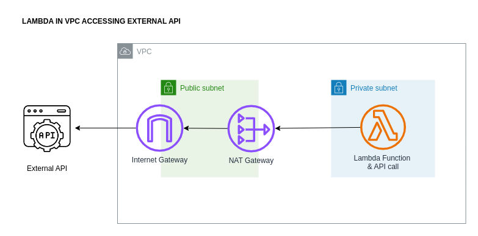

# lambda-in-vpc-accessing-api


Deploy a lambda function in a private VPC and access an external API via a NAT Gateway.

## What components and services are involved?

<!--

-->

## Run example #01 - a lambda in a private subnet in a vpc and access an external API via a NAT Gateway.
``` 
1.  Deploy steps:
        cd /path/to/aws-cdk-examples/application-load-balanced-lambda/deploy
        npm install
        npm run lambda-in-vpc-accessing-api-app synth
        npm run lambda-in-vpc-accessing-api-app list
        npm run lambda-in-vpc-accessing-api-app deploy
        npm run lambda-in-vpc-accessing-api-app destroy
        
2.  Test the lambda can access the external API. Manually trigger the function in the AWS Console:
        Lambda > Functions > Select Function > Code > Test
    Check the execution results and verify:
        * API response is logged
        * lambda returned 200 OK response
```


## Knowledge & Takeaways
``` 
* CDK is magical and does lots for us out of the box here including:
    - attaches "AWSLambdaVPCAccessExecutionRole" to the lambda role
    - creates a SecurityGroup with inbound and outbound rules of All & All (Protocol & Port)
* Private subnets also get route table entries created by CDK with:
    - one for intra vpc traffice (designated by 10.0.0.0/16)
    - and one for the non-intra vpc traffic (everything else directed to the NAT Gateway in the public subnet. Designated by 0.0.0.0/0)
  
* Public subnets get route table entries created by CDK with:
    - all non-intra vpc traffic to the Internet Gateway (IGW).

* node.js v18 includes a fetch API (meaning a node-fetch dependency is no longer required to call an API)

* AWS recommends use of the event type model "@types/aws-lambda" (but we choose not to implement in our generic example). 
  Please see https://github.com/awsdocs/aws-lambda-developer-guide/blob/main/doc_source/typescript-handler.md
```

## References
* https://github.com/awsdocs/aws-lambda-developer-guide/blob/main/doc_source/typescript-handler.md