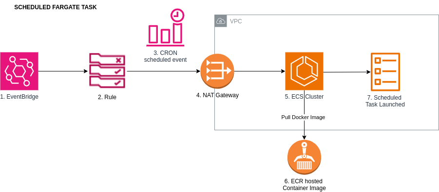

# scheduled-fargate-task

## Diagram




## Run example #01 - a scheduled Fargate task
``` 
1.  Deploy a task triggered to run at a scheduled time via an EventBridge rule
        cd /path/to/aws-cdk-examples/scheduled-fargate-task
        npm run scheduled-fargate-task-01-app synth
        npm run scheduled-fargate-task-01-app list
        npm run scheduled-fargate-task-01-app deploy
        npm run scheduled-fargate-task-01-app destroy
        
2.  Confirm the task runs in Cloudwatch by looking at the /ecs/scheduled-fargate-task log group.
    Each scheduled run launches a new instance of the container which runs, executes the command passed to the container 
    and then terminates.
```

## Run example #02 - a scheduled Fargate task using a higher level L3 construct
``` 
1.  Deploy a task that is triggered to run via EventBridge at a scheduled time
        cd /path/to/aws-cdk-examples/scheduled-fargate-task
        npm run scheduled-fargate-task-02-app synth
        npm run scheduled-fargate-task-02-app list
        npm run scheduled-fargate-task-02-app deploy
        npm run scheduled-fargate-task-02-app destroy
        
2.  Confirm the task runs in Cloudwatch by looking at the /ecs/scheduled-fargate-task log group.
    Each scheduled run launches a new instance of the container which runs, executes the command passed to the container
    and then terminates.
```

## Knowledge Takeaways
* Tasks in ECS are one off containers. They are automatically terminated once the code in the docker container runs or the command sent to the docker container completes.
* Services in ECS on the other hand will maintain a fixed number of Tasks running (to maintain the DesiredCount of tasks).


